# Background

In the past year, I have been to 3 concerts. 
Due to the ever increasing prices of concert tickets, I choose to go to concerts of only those artists whose sound I like a lot. 
This portfolio is a comparison of the 3 artists whose concert I saw, and the albums they toured with. 

* The 3 artists and albums are: 
  + 1) Wolf Alice- The Clearing
  + 2) Laufey- A Matter of Time/ AMAT
  + 3) Lizzy Mcalpine- Older (and Wiser)


* The 3 songs I have chosen to represent each of the albums are respectively:
  + 1) White Horses
  + 2) Carousel
  + 3) Broken Glass

As I am investigating the reasons for my interest in hearing these albums in a concert, I chose the songs which I enjoyed listening to the most in the concert.

With this corpus, my purpose is to investigate how similar or different my tastes are in regards to who I want to see in concert. I want to identify whether there are common features which may draw me to these albums.

My initial hypothesis is that there will be quite a lot of differences.

I perceive Lizzy Mcalpine to have a slow and soothing sound. She writes more traditionally 'sad' songs, but as she is supported by a band, they are sometimes also quite instrument heavy.
Laufey is known to combine Jazz, Pop and Classical music. I would describe her songs as more whimsical, as if you were in a fairytale. 
Wolf Alice is an alternative rock band, with more energetic songs than the other two. 

# Track Insights

## Row 
Laufey’s music is a mix of classical music, jazz and bedroom pop. Her music can range from sad and melancholic to a more playful sound. In my opinion, all her songs have a ‘fairytale’ sound to them, which may be due to the influences from ballet. 

Lizzy Mcalpine dabbles majorly in the genre of Indie pop.  Even though her latest album ‘Older (and Wiser)’ has a bigger focus on instrumentation, with a sort of rock feel as well than her previous work. One can still feel the common theme of emotional rawness throughout, perhaps even more so by recording with a live band for this album.

Wolf Alice is an Indie/Alternative rock band. They are naturally more instrumental heavy, and more energetic than the other two as well. I would expect their songs to have more valence, energy and loudness. 

## Row
### Column 

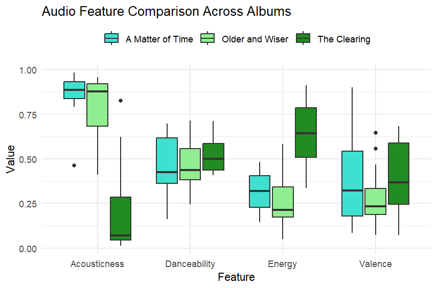

In this image we can see that indeed, acousticness in The Clearing is much lower than the other two and energy is much higher. 
An interesting result is that the danceability for all 3 albums are pretty similar, and the valence for 'Older' and 'AMAT' is similar. In both my experiences listening to the albums online and in the concert, there was a noticeable difference in those features.

Older is almost entirely the type of album to which you would just sit down and listen. 
A matter of time has variety between 'danceable' songs and more slower songs. However, when listening it feels much more 'happy' than Older.
Most of the songs in The Clearing were quite danceable songs. 

### Column
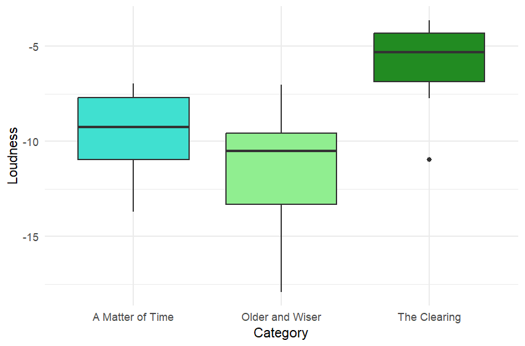

In loudness, as expected, The Clearing is louder than the other two. 

## Row 

Overall, we can see that the albums 'A matter of time' and 'Older and Wiser' tend to be more similar to each other, than either of them are to 'The Clearing'. If one were to listen to these albums, this is also quite clear sonically.

# Chroma 

## Row {height=10%}

Chromagrams tells us which pitch classes are being played in the songs. In order to calculate the chromagrams, I found that the 'chebyshev' norm gave the clearest graph. 

## Row {height=60%}

### Column
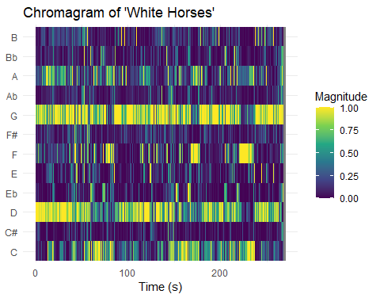
In the chromagram we can see an almost continuous high magnitude for pitch classes G and D. I believe this is indicating the guitar. The guitarist plays a consistent riff throughout the song which is quite prominent. The only very noticeable gaps we see are around 80 seconds, 170 seconds, and 230 seconds which are the three parts of the song where the chorus is being sung. In these parts, since the vocals become much louder, and the guitar much softer, the software picks up on that instead.

In these parts we can see the pitch F being picked up, this is of the vocals in the chorus. Another interesting thing to note in the chorus, the vocals always go from Eb to F. During the lyrics, 'Know who I am..' she sings in Eb but starting from 'That's important to me..' she goes into F. 

Finally, the parts where the C pitch suddenly has very high magnitude and then fades out, is where the bassist played just one C note, and then that note gradually fades out.


### Column
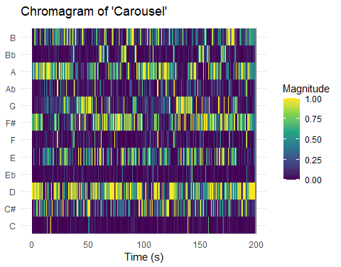
In carousel, there is a repeating motif (a pattern using the notes D,E,F#, B) played with the Dmaj chord in a 4/4 rhythm on the piano while these notes are being played. This can be seen right at the start of the song up until around 10 seconds. 

At 10 seconds, we see that the the vocals start with the chord Dmaj still being played in the background, but the pattern of notes stop. 
Here, we can see the pitch class E have a higher magnitude, which is of Laufey's vocals. 

There is a similar repetition of what I have described above throughout the song. 

Another interesting thing to note is there is a pitch change in the vocals around 40 seconds and 125 seconds, where we can see this pitch class G. This is where she sings the pre-chorus which is a distinctly different pitch from the vocals of the rest of the song. 


### Column
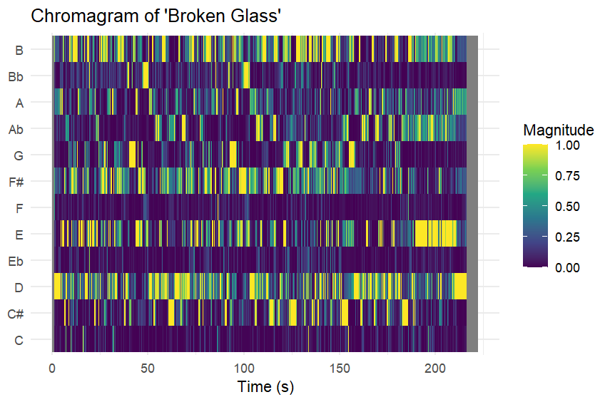
'Broken glass' has 4 main sections of the song. Until around 130 seconds, the song is slow, which is usual for her style, however while it is slow, it does have quite a bit of instrumentation.
Around 130 seconds it builds up to a part with heavy drums, loud vocals, and an energetic, almost rock sound.
Which goes back to to the slow sound around 150 seconds.
And finally, around 180 seconds, the vocals completely disappear and the it's just an instrumentation part with heavy drums, guitar and piano. 

This could explain why around 150 seconds, G pitch completely disappears and we see Ab a lot more consistently

Also at 40 seconds and 100 seconds we see tiny sections in Bb, here she changes to a much higher pitch, singing in a head voice.

## Row {height=30%}

We can see that 'White Horses' has the cleanest chromagram, which makes sense as this song follows a quite repetitive pattern with the same drum beat, guitar riff and vocals throughout. 

'Carousel' is a bit harder to interpret, this is due to the many different instruments used. There are string instruments which are known to have a lot of harmonics, which must be getting captured, flute sections, and of course the piano going on in the background as well.

'Broken Glass' also does not have the cleanest chromagram. This is because there are many instruments involved, again there's strings, flutes, drums, and very heavy vocals throughout. 

From the analysis of the chromagrams of these three songs, I see the same pattern that Laufey and Lizzy Mcalpine's songs are more similar to each other, than they are to Wolf Alice's songs. 

However, it can also be seen that all the songs have one similarity: they all make heavy use of instrumentation, though in different forms. Be it through the vocals and the subtle instrumentation or the heavy use of the drums and guitars, all the songs make heavy use of instrumentation. From this, I conclude that I tend to enjoy songs that make heavy use of instrumentation in a live setting. Hearing many instruments together creates a very powerful atmosphere, and gives concerts that distincly "live" and "real" feel


# Timbre

## Row
I used these specification

## Row
### Column

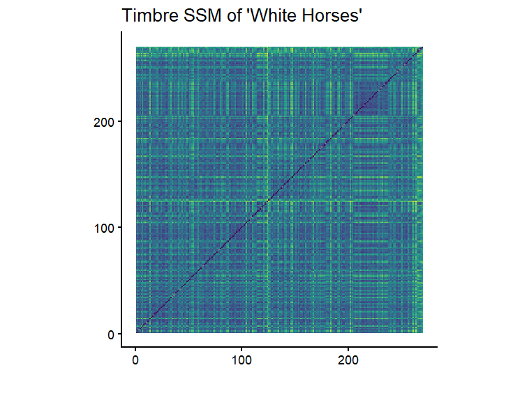

change thses specs back to same as others?
what do i see in timbre

### Column

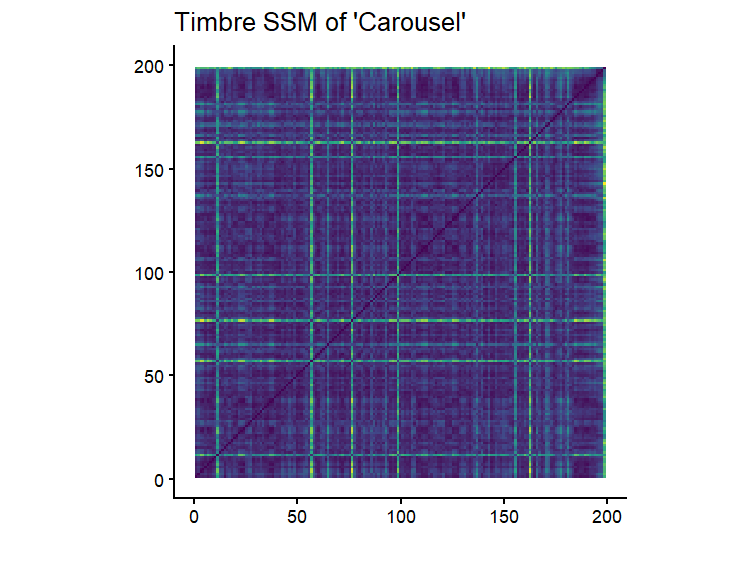

### Column

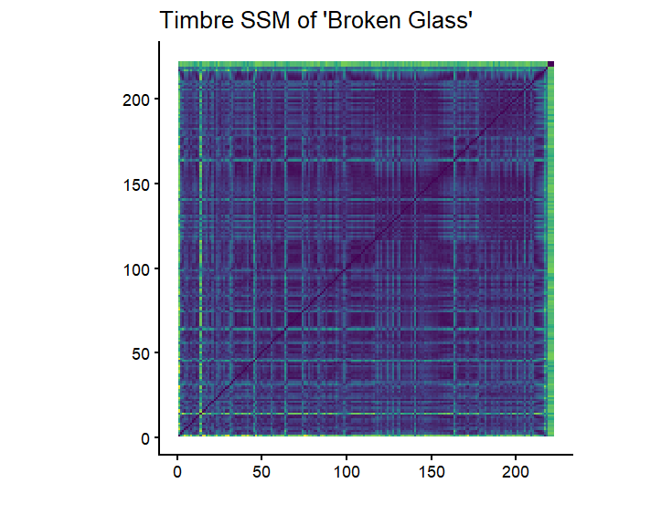
### Row

conlucsion, similarities, differences

# Chordogram

## Row
### Column

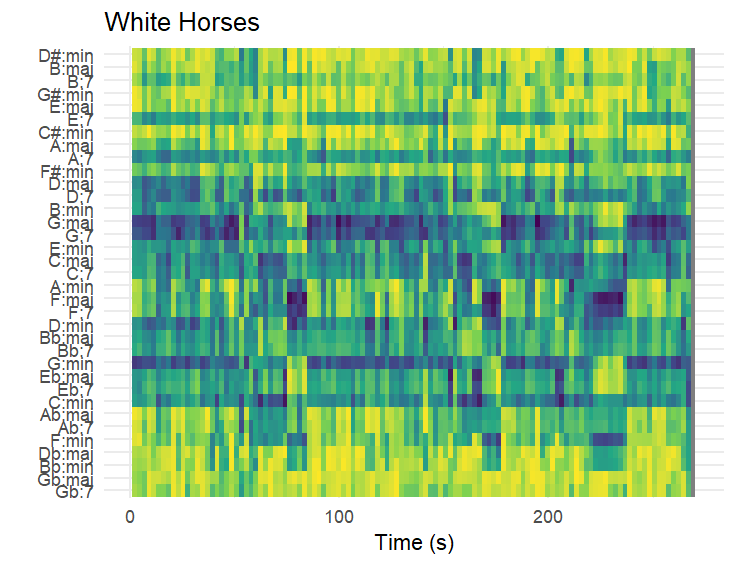

change thses specs back to same as others?
what do i see in timbre

### Column

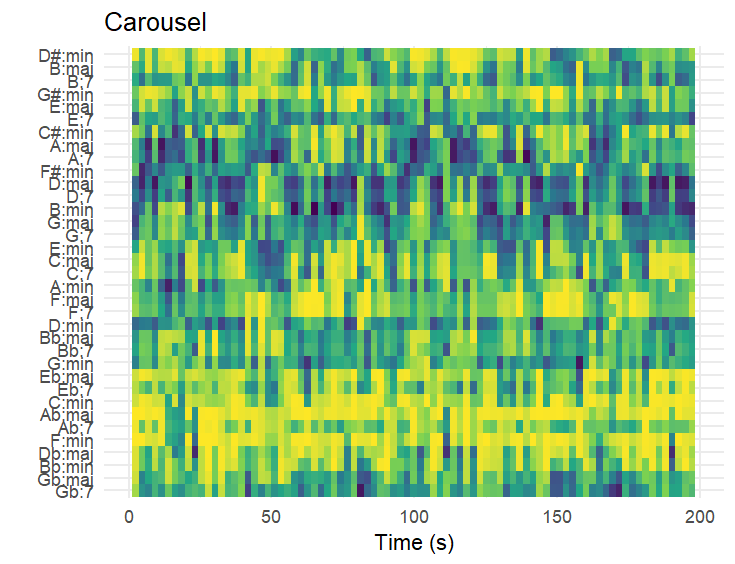

### Column

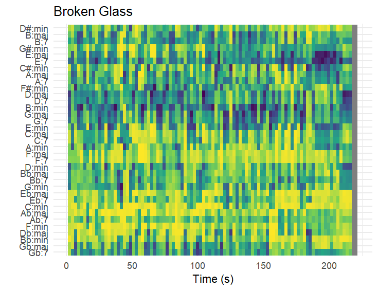

# Tempo
## Row 
wanna put the better one and the novelty function maybe? like if a particular part has good/interesting onset detection or something idk 

## Row

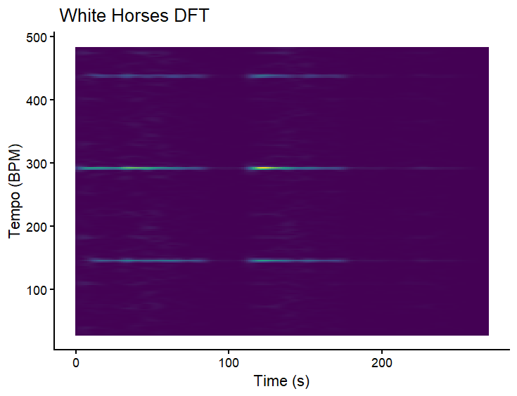


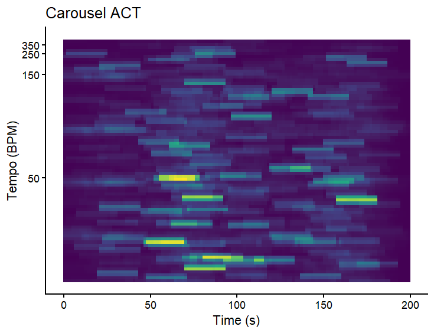


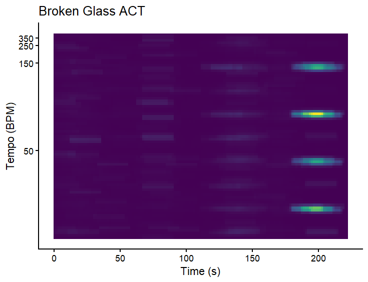


# Classification


```{r}
#| echo: false
2 * 2
```

The `echo: false` option disables the printing of code (only output is displayed).
